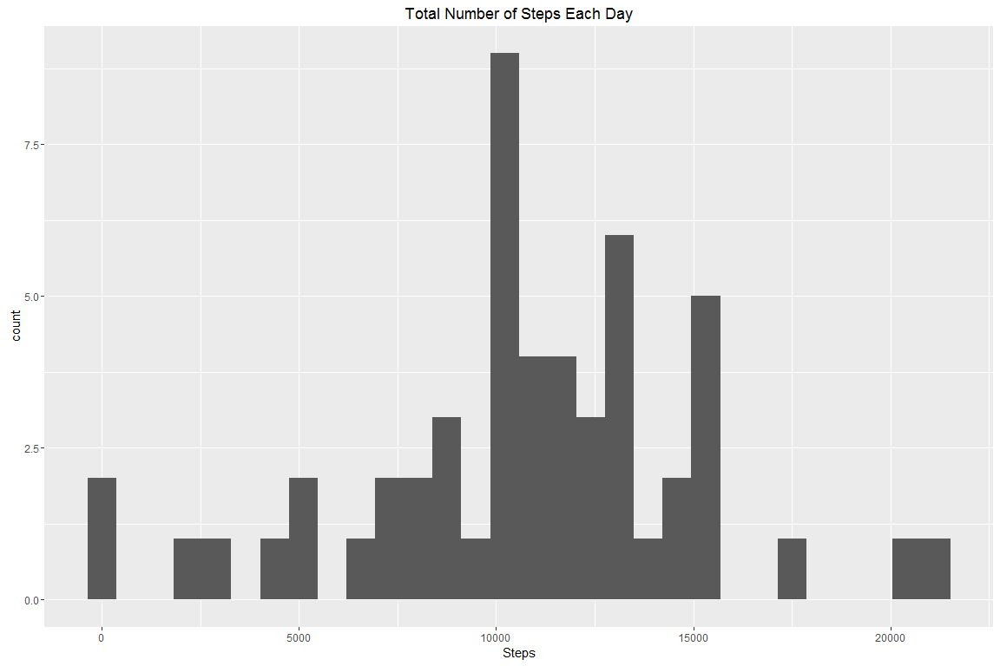
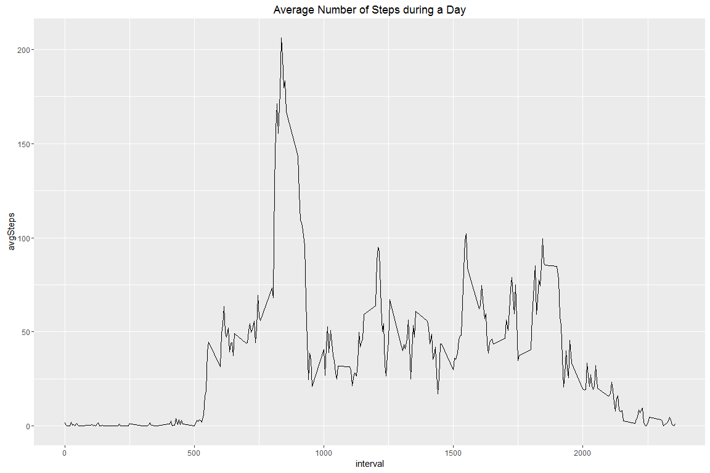
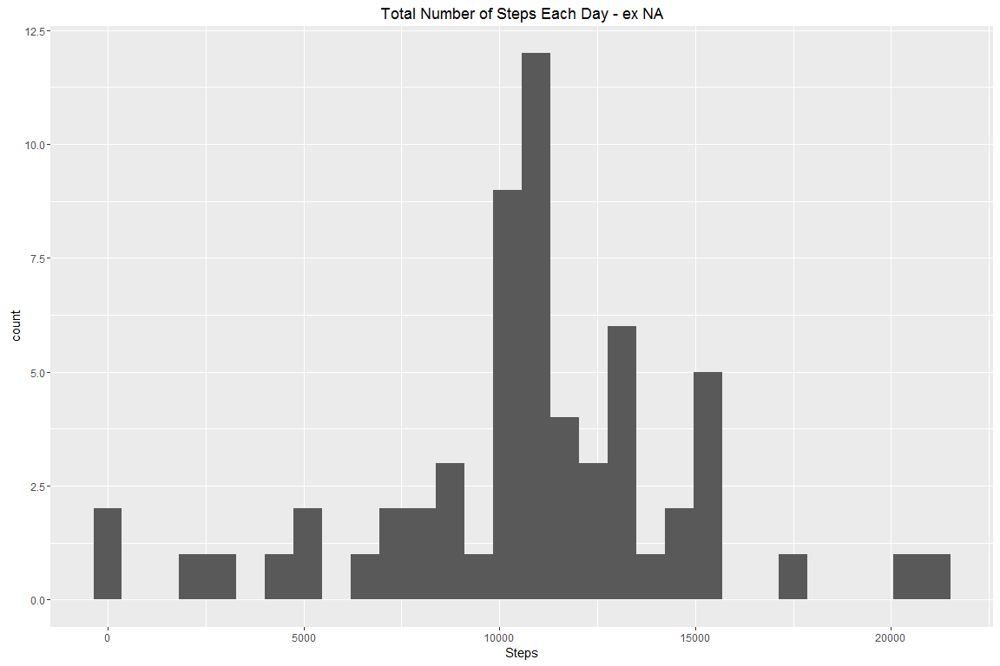
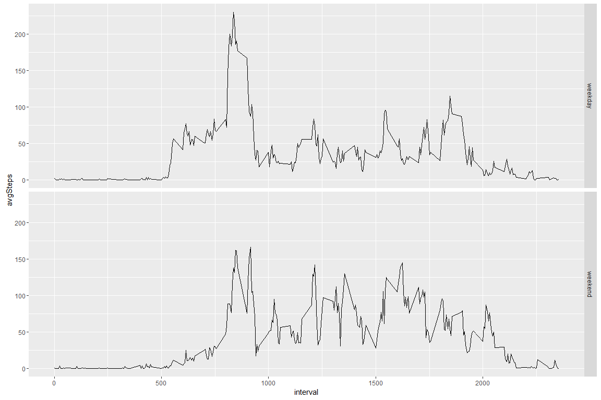

Coursera Reproducible Research Week 2
=====================================

Loading the data
----------------

    table<-read.csv(file="activity.csv",header = TRUE,colClasses = c("numeric","Date","numeric"))

    library(ggplot2)
    library(dplyr)

Q1: What is mean total number of steps taken per day? NA omited
---------------------------------------------------------------

Make a histogram of the total number of steps taken each day

        dailyData <- table %>% group_by(date) %>% summarise(Steps = sum(steps))
        dailyHist <-ggplot(data=dailyData,aes(x=Steps))+geom_histogram()+ggtitle("Total Number of Steps Each Day")
        dailyHist

        dailyMean <-mean(dailyData$Steps,na.rm = TRUE)
        dailyMean

    ## [1] 10766.19

        dailyMed <-median(dailyData$Steps,na.rm = TRUE)
        dailyMed

    ## [1] 10765

Q2: What is the average daily activity pattern?
-----------------------------------------------

        dailyInterval <- table %>% group_by(interval) %>% summarise(avgSteps = mean(steps,na.rm=TRUE))
        dailyLine <- ggplot(data=dailyInterval,aes(x=interval,y=avgSteps))+geom_line()+ggtitle("Average Number of Steps during a Day")
        dailyLine

        print(paste0("On average, the maximum number of steps is during the inverval: ",dailyInterval[dailyInterval$avgSteps==max(dailyInterval$avgSteps),1]))

    ## [1] "On average, the maximum number of steps is during the inverval: 835"

Q3: Imputing missing values
---------------------------

Calculate Nb of NAs

        summary(table)

    ##      steps             date               interval     
    ##  Min.   :  0.00   Min.   :2012-10-01   Min.   :   0.0  
    ##  1st Qu.:  0.00   1st Qu.:2012-10-16   1st Qu.: 588.8  
    ##  Median :  0.00   Median :2012-10-31   Median :1177.5  
    ##  Mean   : 37.38   Mean   :2012-10-31   Mean   :1177.5  
    ##  3rd Qu.: 12.00   3rd Qu.:2012-11-15   3rd Qu.:1766.2  
    ##  Max.   :806.00   Max.   :2012-11-30   Max.   :2355.0  
    ##  NA's   :2304

        print(paste0("The sum of NA's in the dataset is ",sum(is.na(table))))

    ## [1] "The sum of NA's in the dataset is 2304"

Fill NA values by the Average of the interval

        AggTable <- merge(table,dailyInterval,by=c("interval"))
        AggTable$FixSteps <- ifelse(is.na(AggTable$steps),AggTable$avgSteps,AggTable$steps)

Create a new dataset that is equal to the original dataset but with the
missing data filled in

        Table_exNA <- AggTable[,c("date","interval","FixSteps")]
        colnames(Table_exNA)[3]<-"steps"

Histogram of the total number of steps taken each day

        dailyData_exNA <-  Table_exNA %>% group_by(date) %>% summarise(Steps = sum(steps))
        dailyHist_exNA <-ggplot(data=dailyData_exNA,aes(x=Steps))+geom_histogram()+ggtitle("Total Number of Steps Each Day - ex NA")
        dailyHist_exNA

Calculate Mean and Median

        dailyMean_exNA <-mean(dailyData_exNA$Steps)
        dailyMean_exNA

    ## [1] 10766.19

        dailyMed_exNA <- median(dailyData_exNA$Steps)
        dailyMed_exNA

    ## [1] 10766.19

Both mean and median are really close. this is logic as we replace NA
values by the average

Q4: Are there differences in activity patterns between weekdays and weekends?
-----------------------------------------------------------------------------

    Define Weekday factor

        Table_exNA$WeekdayType <- ifelse(weekdays(Table_exNA$date) %in% c("Saturday","Sunday"),"weekend","weekday")
        
        WeekDayInterval <- Table_exNA %>% group_by(interval,WeekdayType) %>% summarise(avgSteps = mean(steps,na.rm=TRUE))
        WeekDayPlot <- ggplot(data=WeekDayInterval,aes(x=interval,y=avgSteps))+geom_line()+facet_grid(WeekdayType ~ .)
        WeekDayPlot

